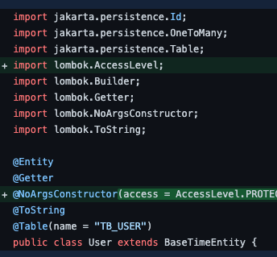
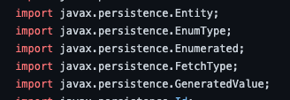
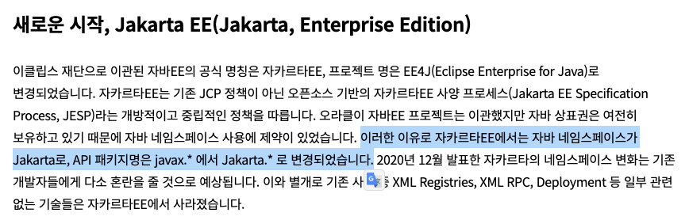
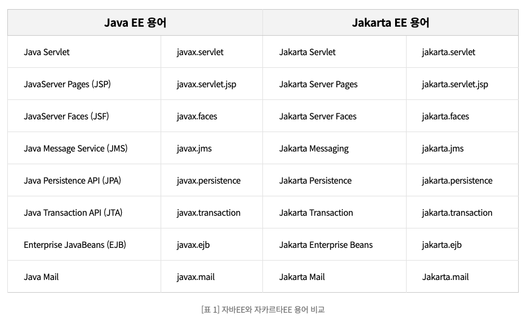
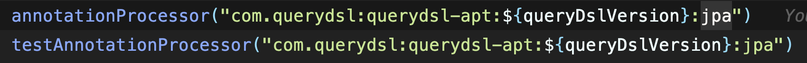
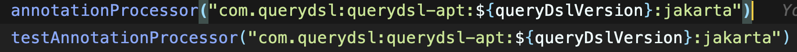
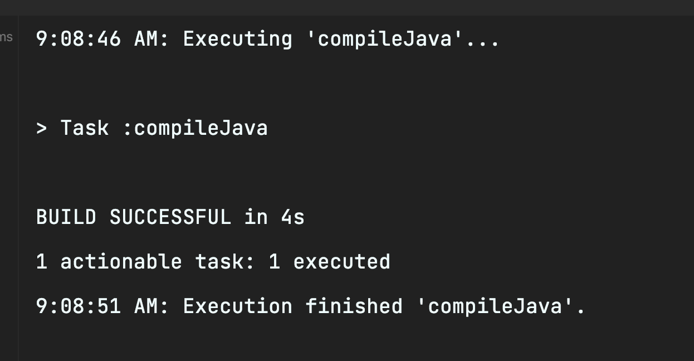

프로젝트를 하나 시작하게 되었다.

이번에는 배움을 위해서 프로젝트를 하는 것이기 때문에 최대한 최신버전을 사용하고, 요즘 많이 쓰는 툴들도 사용하려고 한다.

## spring project setting

< 내가 한 세팅 >

1. 우선 java 버전부터 11에서 17로 바꾸었다.
2. jpa
3. spring boot security
4. lombok
5. mariaDB
6. p6spy
7. Apache commons
8. queryDSL
9. oAuth2
10. war
11. restDocs

위 11개 중에 1, 5, 9, 10 번은 한번도 써보지 못한 세팅이다.

그리고 11번은 딱 한번 써보았으며 3, 8번은 여러 번 써보았지만 공부가 부족하다.

이렇게 세팅을 하고 실행을 했는데 일단, 실행은 되었었다.

하지만, DB를 연결하고 entity를 만들고 나서 문제가 터졌다.

실행을 해보려고 했는데 이런 오류가 떴다.

## error 발생!

## "java.lang.NoClassDefFoundError: javax/persistence/Entity"

아니, 엔티티를 못찾는다니...?

선임과 함께 build.gradle 파일부터 확인을 하였다.

그러다가 찾은 것이 entity에서 import 부분이다.

너무 당연히 javax 인 줄 알고 import했던 부분들이 본 적 없는 jakarta로 되어있었다.

원래는 이런 import여야 한다.

왜 javax가 import에 없는 거지..?

## 에러 발생 이유

찾아보니 원래 오라클이 갖고있던 자바를 이클립스가 가져가고 나서 생긴 일이였다.

https://www.samsungsds.com/kr/insights/java_jakarta.html

위의 링크에서 따온 사진이다. 위 링크를 눌러보면 더 자세한 이야기를 볼 수 있다.

링크에 나온 글에 있는 표이다.

이걸 보면 내가 경험한 import와 같은 부분이 보인다.

버전을 17로 올리면서 생긴 일이라니...

찾아보니 jakarta로 바꿔도 javax 일 때 썼던 모든 기능을 다 해준다고한다.

javax는 버리고 jakarta로 바꿔야 할 때가 왔다.

그러면 어떻게 jakarta로 바꿔야하는 것일까?

정말 친절한 선임이 이 모든 것을 찾아서 알려주었다.

## 문제 해결 방법

build.gradle 파일에서

jpa 부분을

이렇게 jakarta로 바꾸면 된다.

## 성공!!

