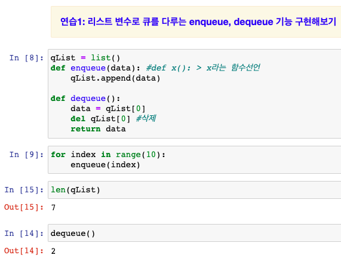

## 꼭 알아둬야 할 자료 구조: 큐 (Queue)

### 1. 큐 구조
* 선입선출, FIFO(First-In, First-Out) 또는 LILO(Last-In, Last-Out) 방식으로 스택과 꺼내는 순서가 반대
  

* 출처: http://www.stoimen.com/blog/2012/06/05/computer-algorithms-stack-and-queue-data-structure/

### 2. 파이썬 Queue()로 큐 만들기

### 3. 파이썬 LIFO Queue()로 큐 만들기

### 4. 파이썬 PriorityQueue()로 큐 만들기

### 참고: 어디에 큐가 많이 쓰일까?

- 멀티 태스킹을 위한 프로세스 스케쥴링 방식을 구현하기 위해 많이 사용됨 (운영체제 참조)

> 큐의 경우에는 장단점 보다는 (특별히 언급되는 장단점이 없음), 큐의 활용 예로 프로세스 스케쥴링 방식을 함께 이해해두는 것이 좋음

### enqueue, dequeue 기능 구현

